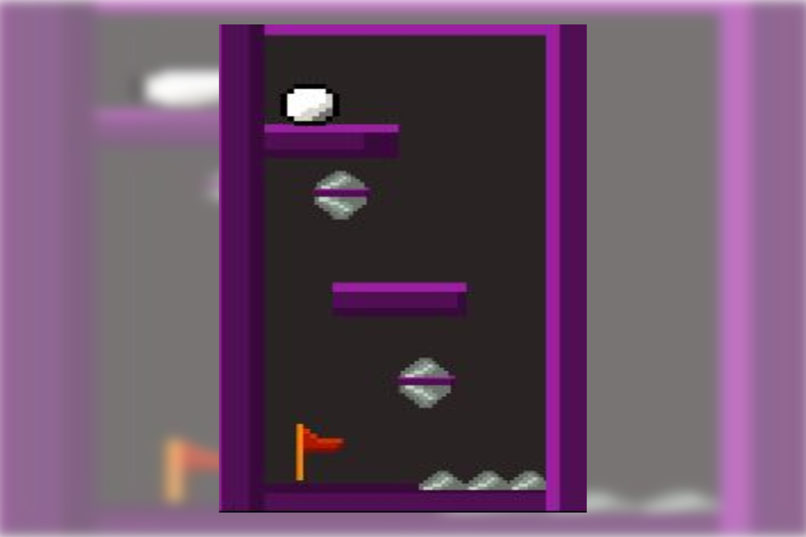
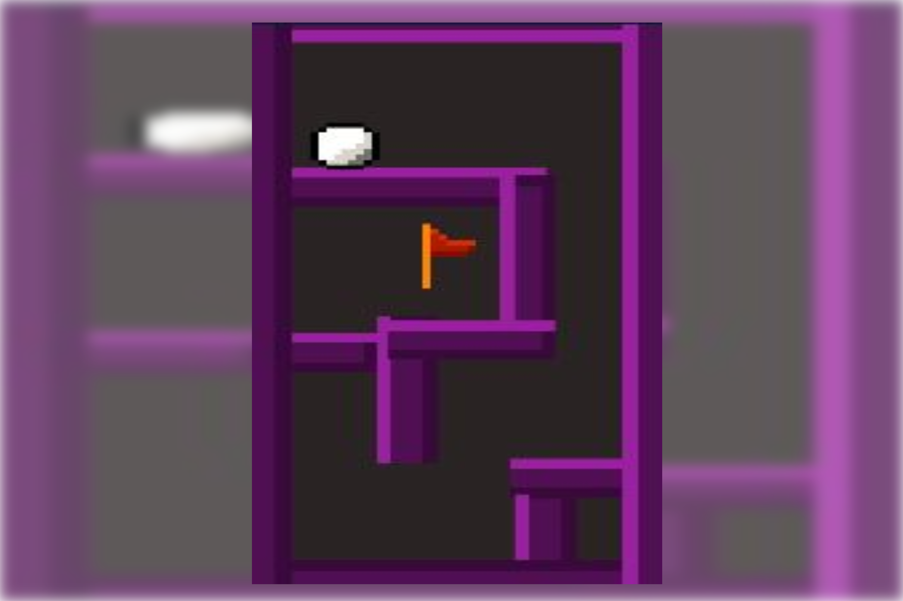
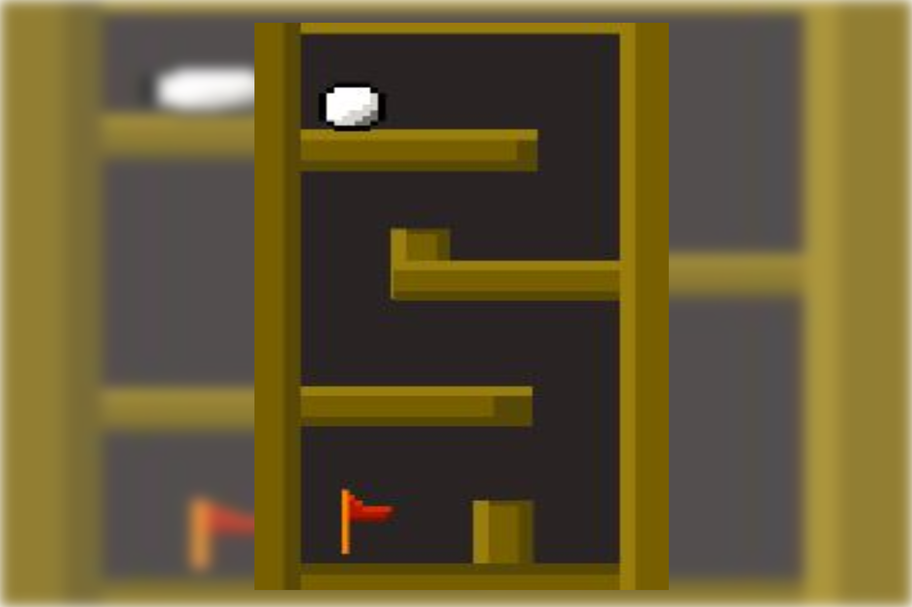

# Gyro Maze Prototype

## Platform:
  
 
 ## Download: 

<a href = "#"> </a>
## Description:
Gyro Maze is a game where you move your cellphone to move the ball to the goal. 
You control the ball with the Gyroscope sensor in your cellphone.

## Programming Language:

  
 
## Technologies:

  
 
## Screenshoots:
 
  
  
  

  
